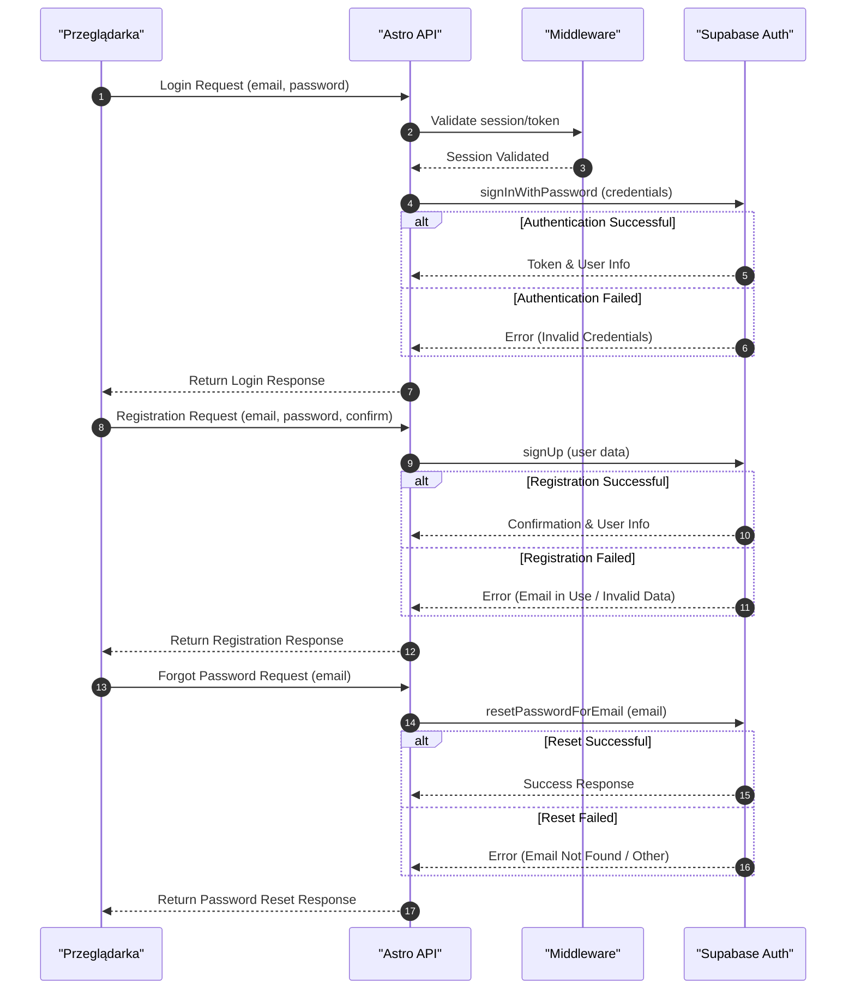

```mermaid
sequenceDiagram
    autonumber
    %% Login Flow
    participant B as "Przeglądarka"
    participant A as "Astro API"
    participant M as "Middleware"
    participant S as "Supabase Auth"

    B->>A: Login Request (email, password)
    A->>M: Validate session/token
    M-->>A: Session Validated
    A->>S: signInWithPassword (credentials)
    alt Authentication Successful
        S-->>A: Token & User Info
    else Authentication Failed
        S-->>A: Error (Invalid Credentials)
    end
    A-->>B: Return Login Response

    %% Registration Flow
    B->>A: Registration Request (email, password, confirm)
    A->>S: signUp (user data)
    alt Registration Successful
        S-->>A: Confirmation & User Info
    else Registration Failed
        S-->>A: Error (Email in Use / Invalid Data)
    end
    A-->>B: Return Registration Response

    %% Password Recovery Flow
    B->>A: Forgot Password Request (email)
    A->>S: resetPasswordForEmail (email)
    alt Reset Successful
        S-->>A: Success Response
    else Reset Failed
        S-->>A: Error (Email Not Found / Other)
    end
    A-->>B: Return Password Reset Response
```