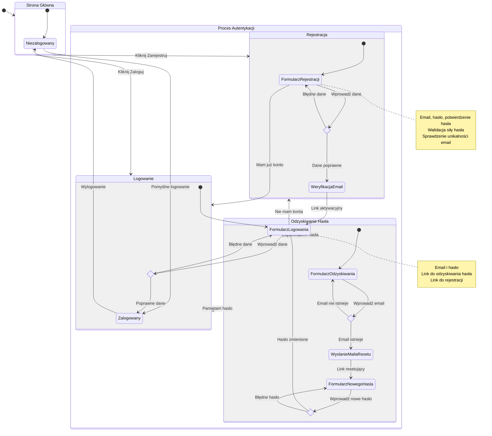

```mermaid
stateDiagram-v2
    [*] --> StronaGlowna
    
    state "Strona Główna" as StronaGlowna {
        state "Niezalogowany" as Niezalogowany
        state "Zalogowany" as Zalogowany
        
        [*] --> Niezalogowany
        Niezalogowany --> Zalogowany: Pomyślne logowanie
        Zalogowany --> Niezalogowany: Wylogowanie
    }
    
    state "Proces Autentykacji" as Autentykacja {
        state "Logowanie" as Logowanie {
            state "FormularzLogowania" as FormularzLogowania
            state if_logowanie <<choice>>
            
            [*] --> FormularzLogowania
            FormularzLogowania --> if_logowanie: Wprowadź dane
            if_logowanie --> Zalogowany: Poprawne dane
            if_logowanie --> FormularzLogowania: Błędne dane
            
            note right of FormularzLogowania
                Email i hasło
                Link do odzyskiwania hasła
                Link do rejestracji
            end note
        }
        
        state "Rejestracja" as Rejestracja {
            state "FormularzRejestracji" as FormularzRejestracji
            state if_rejestracja <<choice>>
            state "WeryfikacjaEmail" as WeryfikacjaEmail
            
            [*] --> FormularzRejestracji
            FormularzRejestracji --> if_rejestracja: Wprowadź dane
            if_rejestracja --> WeryfikacjaEmail: Dane poprawne
            if_rejestracja --> FormularzRejestracji: Błędne dane
            WeryfikacjaEmail --> FormularzLogowania: Link aktywacyjny
            
            note right of FormularzRejestracji
                Email, hasło, potwierdzenie hasła
                Walidacja siły hasła
                Sprawdzenie unikalności email
            end note
        }
        
        state "Odzyskiwanie Hasła" as OdzyskiwanieHasla {
            state "FormularzOdzyskiwania" as FormularzOdzyskiwania
            state if_odzyskiwanie <<choice>>
            state "WyslanieMailaResetu" as WyslanieMailaResetu
            state "FormularzNowegoHasla" as FormularzNowegoHasla
            state if_nowe_haslo <<choice>>
            
            [*] --> FormularzOdzyskiwania
            FormularzOdzyskiwania --> if_odzyskiwanie: Wprowadź email
            if_odzyskiwanie --> WyslanieMailaResetu: Email istnieje
            if_odzyskiwanie --> FormularzOdzyskiwania: Email nie istnieje
            WyslanieMailaResetu --> FormularzNowegoHasla: Link resetujący
            FormularzNowegoHasla --> if_nowe_haslo: Wprowadź nowe hasło
            if_nowe_haslo --> FormularzLogowania: Hasło zmienione
            if_nowe_haslo --> FormularzNowegoHasla: Błędne hasło
        }
    }
    
    StronaGlowna --> Logowanie: Kliknij Zaloguj
    StronaGlowna --> Rejestracja: Kliknij Zarejestruj
    FormularzLogowania --> OdzyskiwanieHasla: Zapomniałem hasła
    FormularzLogowania --> Rejestracja: Nie mam konta
    FormularzRejestracji --> Logowanie: Mam już konto
    OdzyskiwanieHasla --> Logowanie: Pamiętam hasło
``` 