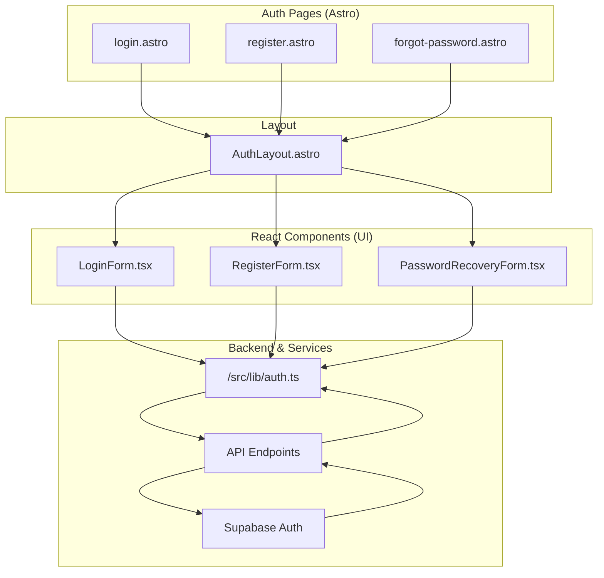

```mermaid
flowchart TD
    subgraph "Auth Pages (Astro)"
        LP["login.astro"]
        RP["register.astro"]
        FP["forgot-password.astro"]
    end

    subgraph "Layout"
        AL["AuthLayout.astro"]
    end

    subgraph "React Components (UI)"
        LF["LoginForm.tsx"]
        RF["RegisterForm.tsx"]
        PF["PasswordRecoveryForm.tsx"]
    end

    subgraph "Backend & Services"
        AS["/src/lib/auth.ts"]
        AE["API Endpoints"]
        SU["Supabase Auth"]
    end

    LP --> AL
    RP --> AL
    FP --> AL
    AL --> LF
    AL --> RF
    AL --> PF
    LF --> AS
    RF --> AS
    PF --> AS
    AS --> AE
    AE --> SU
    SU --> AE
    AE --> AS
``` 